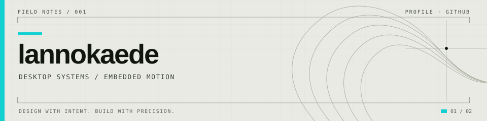

<picture>
  <source media="(prefers-color-scheme: dark)" srcset="assets/profile-dark.svg">
  
</picture>

# 你好，我是 lannokaede

我喜欢把清晰的交互设计和可靠的工程实现放在一起。最近在做桌面客户端体验与嵌入式运动控制。

## 01 / CONTRIBUTIONS · 贡献记录

<picture>
  <source media="(prefers-color-scheme: dark)" srcset="https://ghchart.rshah.org/14D0D0/lannokaede">
  
</picture>

[查看 GitHub 原生贡献记录](https://github.com/lannokaede?tab=overview)

## 02 / SELECTED WORK · 代表项目

`01 / INTERFACE SYSTEMS` 
**[codex-theme-endfield →](https://github.com/lannokaede/codex-theme-endfield)** 
ChatGPT Windows 客户端的视觉增强层，以纸墨、工程图形和信号色组织交互。

`02 / EMBEDDED SYSTEMS` 
**[ESP32-MicroROS-Racer →](https://github.com/lannokaede/ESP32-MicroROS-Racer)** 
基于 ESP32-S3 的智能小车控制项目，探索 FreeRTOS 任务调度、传感器读取与运动控制。

DESKTOP SYSTEMS / EMBEDDED MOTION · <a href="https://github.com/lannokaede?tab=repositories">所有仓库 →</a>
